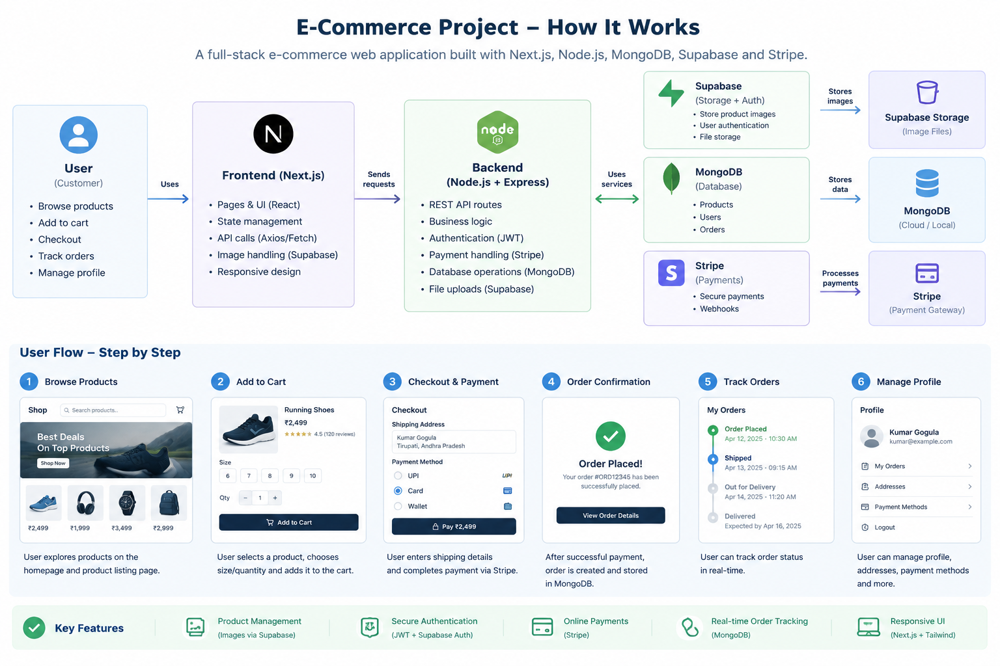

# Ecommercery


A full-stack fashion e-commerce application built with Next.js 13 (App Router). It has two sides in one codebase: a customer-facing storefront (browse products, manage a cart, save addresses, pay with Stripe, track orders) and an admin panel (add, update, and delete products, manage incoming orders). The frontend and the backend API both live inside the same Next.js project; there is no separate backend server.

This document explains what the project does, how it is put together at a high level, how each individual piece works at a low level, and gives a complete reference for every API endpoint with a working curl example.

## 1. Project Overview

Ecommercery is a two-role application:

- Customer role: browse products by category (men, women, kids, or all), view product details, add items to a cart, save one or more shipping addresses, check out through Stripe, and view past orders.
- Admin role: add new products (including uploading a product image), edit or delete existing products, and view and update the status of customer orders.

Both roles sign in through the same login page. The account's `role` field (stored in MongoDB and encoded into the JWT at login) determines which parts of the app a user is allowed to reach; the same physical routes render different content and different navigation depending on that role.

Data is stored in MongoDB (users, products, cart items, addresses, orders). Product images are stored in Supabase Storage rather than in the database; the database only stores the resulting image URL. Payments are processed through Stripe Checkout, and the actual charge never touches this application's own servers directly.

## 2. Tech Stack

| Concern | Technology |
|---|---|
| Framework | Next.js 13, App Router, Route Handlers for the API |
| UI | React 18, Tailwind CSS |
| Client-side state | React Context (`GlobalContext`), `js-cookie` for the auth token, `localStorage` for caching the current user and cart |
| Database | MongoDB, accessed through Mongoose |
| Authentication | JSON Web Tokens (`jsonwebtoken`), password hashing with `bcryptjs` |
| Request validation | Joi schemas on the write endpoints |
| File storage | Supabase Storage (product images), uploaded directly from the browser |
| Payments | Stripe Checkout |
| Notifications | `react-toastify` |

## 3. High-Level Design



*High-level architecture of the Ecommercery application.*

At a high level, the system has four participants: the browser, the Next.js server (which serves both pages and API routes), MongoDB, and two external services (Supabase Storage and Stripe).

```
                    +-------------------------------------------+
                    |                 Browser                    |
                    |  React pages, GlobalContext, Cookies/LS     |
                    +-----------------+---------------------------+
                                      |
                +---------------------+----------------------+
                |                                             |
     fetch("/api/...")                              direct upload / read
     with Authorization: Bearer <JWT>                (publishable key)
                |                                             |
                v                                             v
    +-----------------------------+              +---------------------------+
    |   Next.js Route Handlers    |              |     Supabase Storage       |
    |   (src/app/api/**/route.js) |              |   bucket: images/ecommerce |
    |   - verifies JWT (AuthUser) |              +---------------------------+
    |   - validates body (Joi)    |
    |   - talks to MongoDB        |
    +--------------+--------------+
                   |
                   v
         +-------------------+
         |     MongoDB        |
         |  users, products,  |
         |  cart, addresses,  |
         |  orders            |
         +-------------------+

    Checkout flow only:
    Browser -> /api/stripe -> Stripe Checkout Session -> Stripe-hosted payment page
    -> redirect back to /checkout?status=success -> Browser -> /api/order/create-order -> MongoDB
```

Key architectural decisions:

- There is no separate backend service. Every API route is a file under `src/app/api/**/route.js`, deployed as part of the same Next.js application as the pages.
- Authentication is stateless. The server does not keep a session store; every protected request must carry a JWT in the `Authorization` header, and the server verifies it on every call.
- The admin role is not a separate application. It is the same Next.js app, gated by the `role` field embedded in the JWT and checked inside each admin route handler.
- Product images bypass the application server entirely. The browser uploads the file straight to Supabase Storage using a public (non-secret) key, gets back a URL, and only that URL is ever sent to the Next.js API and stored in MongoDB. The server never receives or handles the raw image bytes.
- Payment collection is delegated to Stripe. The server only creates a Checkout Session (a description of what is being purchased); Stripe hosts the actual payment page, so card details never pass through this application.

## 4. Low-Level Design

### 4.1 Folder structure

```
src/
  app/
    page.js                       Home page (hero, sale rail, category tiles)
    layout.js                     Root layout: fonts, global providers, navbar
    globals.css                   Tailwind base styles and brand tokens
    database/index.js             Mongoose connection helper (connectToDB)
    login/, register/             Auth pages
    account/                      Saved addresses, quick links to orders
    cart/                         Cart page
    checkout/                     Address selection, Stripe redirect, order placement
    orders/, orders/[order-details]/   Order history and a single order's detail view
    product/[details]/            Single product detail page
    product/listing/{all-products,men,women,kids}/   Category listing pages
    admin-view/                   Admin dashboard (all orders)
    admin-view/add-product/       Add/update product form (image upload lives here)
    admin-view/all-products/      Admin product management grid
    api/                          All backend route handlers (see section 6)
  components/
    Navbar/                       Top navigation, role-aware links, login/logout
    CommonListing/                Product grid used by every listing page
      ProductTile/                Single product card (image, price, name)
      ProductButtons/             Context-aware actions: Add to cart (customer) or Update/Delete (admin)
    CommonDetails/                Product detail layout
    CommonCart/                   Cart line-item list shared by CartModal and the cart page
    CartModal/                    Slide-over cart preview
    CommonModal/                  Generic modal shell used by CartModal and the mobile nav
    FormElements/                 InputComponent, SelectComponent, TileComponent (size picker)
    Loader/componentlevel/        Small inline spinner used inside buttons during requests
    Notification/                 Wrapper around react-toastify
  context/index.js                GlobalContext: all cross-page client state
  services/                       One file per resource; each function wraps a fetch call to an API route
    product/, cart/, address/, order/, login/, register/, stripe/, storage/
  lib/supabase.js                 Supabase client (publishable key, browser-safe)
  middleware/AuthUser.js          Verifies the JWT on incoming API requests
  models/                         Mongoose schemas: user, product, cart, address, order
  utils/index.js                  Static option lists (nav items, category options, size options, form field configs)
```

### 4.2 Client-side state (GlobalContext)

`src/context/index.js` is a single React Context provider that wraps the entire app in `layout.js`. It holds everything that needs to be shared across otherwise-unrelated pages and components:

- `isAuthUser`, `user` - whether someone is logged in and who they are; hydrated on first load from the `token` cookie and the `user` key in `localStorage`.
- `cartItems` - the customer's current cart, kept in sync with the `/api/cart/*` endpoints.
- `showCartModal`, `showNavModal` - visibility flags for the two slide-over/modal UI elements.
- `componentLevelLoader` - a `{ loading, id }` pair used to show a spinner on the specific button that triggered a request (for example, only the Delete button for the product actually being deleted), rather than blocking the whole page.
- `currentUpdatedProduct` - when an admin clicks Update on a product tile, the product is stashed here and the add-product page reads it to pre-fill the form; it is cleared automatically when the admin navigates away from that page.
- `addresses`, `addressFormData` - saved shipping addresses and the form state for adding a new one.
- `checkoutFormData` - the in-progress order object (shipping address, payment method, totals) assembled during checkout before it is sent to `/api/order/create-order`.
- `allOrdersForUser`, `allOrdersForAllUsers`, `orderDetails` - order data for, respectively, the customer's own order history, the admin's view of every order, and a single order's detail page.

### 4.3 The services layer

Every network call the frontend makes is wrapped in a small function under `src/services/<resource>/index.js` (for example `addToCart`, `getAllProducts`, `deleteAProduct`). Each function:

1. Reads the JWT from the `token` cookie (via `js-cookie`) when the target endpoint requires authentication.
2. Calls `fetch` against the matching route under `/api/...`, setting `Authorization: Bearer <token>` where needed.
3. Returns the parsed JSON body (`{ success, data | message }`) directly to the calling component, which then updates `GlobalContext` state or shows a toast.

Components never call `fetch` directly against an API route; they always go through this services layer, which keeps the authentication header logic and the fetch URL in one place per resource.

### 4.4 Authentication, step by step

1. Register (`POST /api/register`): the frontend collects name, email, password, and role. The API hashes the password with `bcryptjs` before storing the user document; the plain password is never persisted.
2. Login (`POST /api/login`): the API looks up the user by email, compares the submitted password against the stored hash, and, if it matches, signs a JWT containing `id`, `email`, and `role`, valid for 1 day, using the `SECRET_KEY` environment variable.
3. The frontend stores this JWT in a cookie named `token` (via `js-cookie`) and caches the user object in `localStorage`, then sets `isAuthUser`/`user` in `GlobalContext`.
4. Every subsequent request to a protected API route includes `Authorization: Bearer <token>`.
5. `src/middleware/AuthUser.js` is called at the top of each protected route handler. It extracts the token from the header, verifies its signature against `SECRET_KEY`, and returns the decoded payload (`{ id, email, role }`) if valid, or `false` if the token is missing, expired, or invalid.
6. Route handlers that are admin-only additionally check `isAuthUser?.role === "admin"` before doing anything; routes that only need "some logged-in user" check that `isAuthUser` is truthy.
7. Logout clears the cookie and `localStorage` client-side; there is no server-side session to invalidate, since JWTs are stateless (an existing token simply continues to be technically valid, unused, until it expires).

### 4.5 Product image storage (Supabase)

Image upload happens entirely in the browser, on the admin Add Product page, and never passes through this application's own API:

1. The admin selects a file. `src/services/storage/index.js` validates its MIME type and size client-side.
2. It generates a unique file name (original name plus a timestamp and a random string) and uploads it directly to the Supabase Storage bucket named by `NEXT_PUBLIC_SUPABASE_STORAGE_BUCKET`, under an `ecommerce/` prefix, using the public/publishable Supabase key.
3. Supabase returns a public URL for the uploaded object.
4. That URL is placed into the product form's `imageUrl` field, and only the URL, not the file, is later sent to `POST /api/admin/add-product` or `PUT /api/admin/update-product` and stored in MongoDB.
5. Every other page that shows product images (ProductTile, CommonDetails, the home page's sale rail and category tiles) simply renders ``; it does not know or care that the URL points at Supabase.

Row Level Security policies on the Supabase bucket restrict uploads to the `ecommerce/` folder and to image file extensions.

### 4.6 Data models

User (`src/models/user.js`)

| Field | Type | Notes |
|---|---|---|
| name | String | |
| email | String | used as the login identifier |
| password | String | bcrypt hash, never the plain password |
| role | String | "customer" or "admin"; drives what the frontend and the API allow |

Product (`src/models/product.js`)

| Field | Type | Notes |
|---|---|---|
| name | String | |
| description | String | |
| price | Number | |
| category | String | men, women, or kids |
| sizes | Array | list of { id, label } picked in the admin form |
| deliveryInfo | String | free text shown on the product page |
| onSale | String | "yes" or "no" |
| priceDrop | Number | percentage off, only meaningful when onSale is "yes" |
| imageUrl | String | Supabase public URL |
| createdAt / updatedAt | Date | automatic (timestamps: true) |

Cart (`src/models/cart.js`)

| Field | Type | Notes |
|---|---|---|
| userID | ObjectId to User | |
| productID | ObjectId to Product | |
| quantity | Number | defaults to 1 |

Address (`src/models/address.js`)

| Field | Type | Notes |
|---|---|---|
| userID | ObjectId to User | |
| fullName, address, city, country, postalCode | String | |

Order (`src/models/order.js`)

| Field | Type | Notes |
|---|---|---|
| user | ObjectId to User | |
| orderItems | Array of { qty, product } | product is an ObjectId to Product |
| shippingAddress | embedded object | fullName, address, city, country, postalCode |
| paymentMethod | String | defaults to "Stripe" |
| totalPrice | Number | |
| isPaid | Boolean | |
| paidAt | Date | |
| isProcessing | Boolean | used by the admin order-management screen |

## 5. Environment Variables

| Variable | Used by | Purpose |
|---|---|---|
| DATABASE_URL | server | MongoDB connection string |
| SECRET_KEY | server | HMAC secret used to sign and verify JWTs |
| PUBLIC_KEY | client | Stripe publishable key |
| PRIVATE_KEY | server | Stripe secret key, used to create Checkout Sessions |
| NEXT_PUBLIC_SUPABASE_URL | client | Supabase project URL |
| NEXT_PUBLIC_SUPABASE_PUBLISHABLE_KEY | client | Supabase publishable/anon key, safe to expose in the browser |
| NEXT_PUBLIC_SUPABASE_STORAGE_BUCKET | client | Storage bucket name for product images (default: images) |
| SUPABASE_SERVICE_ROLE_KEY | server, reserved | Not currently used by any route; kept for a future server-side storage operation, must never be exposed to the client |
| SERVER | client/server | Base URL of the app, used to build absolute URLs for server-rendered fetches and Stripe redirect URLs |

## 6. API Reference

All endpoints are Next.js Route Handlers under `src/app/api/`. Responses are always JSON with at least a `success` boolean; on failure they also include a `message` string. Protected endpoints require the header:

```
Authorization: Bearer <token>
```

where `<token>` is the JWT returned by `POST /api/login`. Replace `$TOKEN` in the examples below with that value, and replace any sample id with a real MongoDB ObjectId from your own database.

### 6.1 Auth

#### POST /api/register

Creates a new account. Public, no token required.

Request body:

```json
{
  "name": "Jane Doe",
  "email": "jane@example.com",
  "password": "at-least-6-characters",
  "role": "customer"
}
```

Curl:

```bash
curl -X POST http://localhost:3000/api/register \
  -H "Content-Type: application/json" \
  -d '{
    "name": "Jane Doe",
    "email": "jane@example.com",
    "password": "supersecret",
    "role": "customer"
  }'
```

Success response:

```json
{ "success": true, "message": "Account created successfully." }
```

#### POST /api/login

Verifies credentials and issues a JWT. Public, no token required.

Request body:

```json
{ "email": "jane@example.com", "password": "supersecret" }
```

Curl:

```bash
curl -X POST http://localhost:3000/api/login \
  -H "Content-Type: application/json" \
  -d '{ "email": "jane@example.com", "password": "supersecret" }'
```

Success response:

```json
{
  "success": true,
  "message": "Login successfull!",
  "finalData": {
    "token": "eyJhbGciOi...",
    "user": { "email": "jane@example.com", "name": "Jane Doe", "_id": "...", "role": "customer" }
  }
}
```

### 6.2 Products

#### GET /api/admin/all-products

Returns every product. Public (used by both the storefront and the admin grid).

Curl:

```bash
curl http://localhost:3000/api/admin/all-products
```

Response: `{ "success": true, "data": [ { "_id": "...", "name": "...", "..." : "..." } ] }`

#### GET /api/admin/product-by-id?id=PRODUCT_ID

Returns a single product. Public.

Curl:

```bash
curl "http://localhost:3000/api/admin/product-by-id?id=6520db4348f5257ec91d7ed2"
```

#### GET /api/admin/product-by-category?id=CATEGORY

Returns every product in a category (men, women, or kids). Public.

Curl:

```bash
curl "http://localhost:3000/api/admin/product-by-category?id=men"
```

#### POST /api/admin/add-product

Creates a product. Requires a token belonging to a user whose role is admin.

Request body:

```json
{
  "name": "Classic Oxford Shirt",
  "description": "100% cotton, tailored fit.",
  "price": 2499,
  "category": "men",
  "sizes": [{ "id": "m", "label": "M" }, { "id": "l", "label": "L" }],
  "deliveryInfo": "Delivered in 3-5 business days.",
  "onSale": "no",
  "priceDrop": 0,
  "imageUrl": "https://your-project-ref.supabase.co/storage/v1/object/public/images/ecommerce/shirt-123.jpg"
}
```

Curl:

```bash
curl -X POST http://localhost:3000/api/admin/add-product \
  -H "Content-Type: application/json" \
  -H "Authorization: Bearer $TOKEN" \
  -d '{
    "name": "Classic Oxford Shirt",
    "description": "100% cotton, tailored fit.",
    "price": 2499,
    "category": "men",
    "sizes": [{ "id": "m", "label": "M" }],
    "deliveryInfo": "Delivered in 3-5 business days.",
    "onSale": "no",
    "priceDrop": 0,
    "imageUrl": "https://your-project-ref.supabase.co/storage/v1/object/public/images/ecommerce/shirt-123.jpg"
  }'
```

Note: the image itself is uploaded straight to Supabase from the browser before this call is made (see section 4.5); this endpoint only ever receives the resulting URL, never the file.

#### PUT /api/admin/update-product

Updates an existing product by _id. Admin only. Body is the same shape as add-product, plus _id.

Curl:

```bash
curl -X PUT http://localhost:3000/api/admin/update-product \
  -H "Content-Type: application/json" \
  -H "Authorization: Bearer $TOKEN" \
  -d '{
    "_id": "6520db4348f5257ec91d7ed2",
    "name": "Classic Oxford Shirt (Updated)",
    "description": "100% cotton, tailored fit.",
    "price": 2299,
    "category": "men",
    "sizes": [{ "id": "m", "label": "M" }],
    "deliveryInfo": "Delivered in 3-5 business days.",
    "onSale": "yes",
    "priceDrop": 10,
    "imageUrl": "https://your-project-ref.supabase.co/storage/v1/object/public/images/ecommerce/shirt-123.jpg"
  }'
```

#### DELETE /api/admin/delete-product?id=PRODUCT_ID

Deletes a product by id. Admin only.

Curl:

```bash
curl -X DELETE "http://localhost:3000/api/admin/delete-product?id=6520db4348f5257ec91d7ed2" \
  -H "Authorization: Bearer $TOKEN"
```

### 6.3 Cart

#### POST /api/cart/add-to-cart

Adds a product to the current user's cart. Requires any logged-in user's token. Fails if the same product is already in the cart.

Curl:

```bash
curl -X POST http://localhost:3000/api/cart/add-to-cart \
  -H "Content-Type: application/json" \
  -H "Authorization: Bearer $TOKEN" \
  -d '{ "userID": "650a1f2c...", "productID": "6520db4348f5257ec91d7ed2" }'
```

#### GET /api/cart/all-cart-items?id=USER_ID

Returns the cart items for a user, with each item's productID populated with the full product document. Requires any logged-in user's token.

Curl:

```bash
curl "http://localhost:3000/api/cart/all-cart-items?id=650a1f2c..." \
  -H "Authorization: Bearer $TOKEN"
```

#### DELETE /api/cart/delete-from-cart?id=CART_ITEM_ID

Removes a single cart line item by its own _id (not the product id). Requires any logged-in user's token.

Curl:

```bash
curl -X DELETE "http://localhost:3000/api/cart/delete-from-cart?id=651a2b3c..." \
  -H "Authorization: Bearer $TOKEN"
```

### 6.4 Addresses

#### POST /api/address/add-new-address

Curl:

```bash
curl -X POST http://localhost:3000/api/address/add-new-address \
  -H "Content-Type: application/json" \
  -H "Authorization: Bearer $TOKEN" \
  -d '{
    "userID": "650a1f2c...",
    "fullName": "Jane Doe",
    "address": "221B Example Street",
    "city": "Hyderabad",
    "country": "India",
    "postalCode": "500001"
  }'
```

#### GET /api/address/get-all-address?id=USER_ID

Curl:

```bash
curl "http://localhost:3000/api/address/get-all-address?id=650a1f2c..." \
  -H "Authorization: Bearer $TOKEN"
```

#### PUT /api/address/update-address

Curl:

```bash
curl -X PUT http://localhost:3000/api/address/update-address \
  -H "Content-Type: application/json" \
  -H "Authorization: Bearer $TOKEN" \
  -d '{
    "_id": "651b3c4d...",
    "fullName": "Jane Doe",
    "address": "221B Example Street, Apt 4",
    "city": "Hyderabad",
    "country": "India",
    "postalCode": "500001"
  }'
```

#### DELETE /api/address/delete-address?id=ADDRESS_ID

Curl:

```bash
curl -X DELETE "http://localhost:3000/api/address/delete-address?id=651b3c4d..." \
  -H "Authorization: Bearer $TOKEN"
```

### 6.5 Checkout and orders

#### POST /api/stripe

Creates a Stripe Checkout Session and returns its id, which the frontend uses to redirect the browser to Stripe's hosted payment page. Requires any logged-in user's token. The request body is passed straight through as Stripe's line_items.

Curl:

```bash
curl -X POST http://localhost:3000/api/stripe \
  -H "Content-Type: application/json" \
  -H "Authorization: Bearer $TOKEN" \
  -d '[
    {
      "price_data": {
        "currency": "inr",
        "product_data": { "name": "Classic Oxford Shirt" },
        "unit_amount": 249900
      },
      "quantity": 1
    }
  ]'
```

Response: `{ "success": true, "id": "cs_test_..." }`. The frontend uses this id with Stripe's client-side redirect helper; Stripe then sends the customer back to SERVER/checkout?status=success or ?status=cancel.

#### POST /api/order/create-order

Called after a successful Stripe redirect to persist the order and empty the user's cart. Requires any logged-in user's token.

Curl:

```bash
curl -X POST http://localhost:3000/api/order/create-order \
  -H "Content-Type: application/json" \
  -H "Authorization: Bearer $TOKEN" \
  -d '{
    "user": "650a1f2c...",
    "orderItems": [{ "qty": 1, "product": "6520db4348f5257ec91d7ed2" }],
    "shippingAddress": {
      "fullName": "Jane Doe",
      "address": "221B Example Street",
      "city": "Hyderabad",
      "country": "India",
      "postalCode": "500001"
    },
    "paymentMethod": "Stripe",
    "totalPrice": 2499,
    "isPaid": true,
    "paidAt": "2026-09-18T00:00:00.000Z",
    "isProcessing": true
  }'
```

#### GET /api/order/get-all-orders?id=USER_ID

Returns one user's own orders, with orderItems.product populated. Requires any logged-in user's token.

Curl:

```bash
curl "http://localhost:3000/api/order/get-all-orders?id=650a1f2c..." \
  -H "Authorization: Bearer $TOKEN"
```

#### GET /api/order/order-details?id=ORDER_ID

Returns a single order by its own _id. Requires any logged-in user's token.

Curl:

```bash
curl "http://localhost:3000/api/order/order-details?id=652c4d5e..." \
  -H "Authorization: Bearer $TOKEN"
```

#### GET /api/admin/orders/get-all-orders

Returns every order in the system, with both orderItems.product and user populated. Admin only.

Curl:

```bash
curl http://localhost:3000/api/admin/orders/get-all-orders \
  -H "Authorization: Bearer $TOKEN"
```

#### PUT /api/admin/orders/update-order

Updates an order's status (for example, marking it as processed). Admin only.

Curl:

```bash
curl -X PUT http://localhost:3000/api/admin/orders/update-order \
  -H "Content-Type: application/json" \
  -H "Authorization: Bearer $TOKEN" \
  -d '{
    "_id": "652c4d5e...",
    "shippingAddress": {
      "fullName": "Jane Doe",
      "address": "221B Example Street",
      "city": "Hyderabad",
      "country": "India",
      "postalCode": "500001"
    },
    "orderItems": [{ "qty": 1, "product": "6520db4348f5257ec91d7ed2" }],
    "paymentMethod": "Stripe",
    "isPaid": true,
    "paidAt": "2026-09-18T00:00:00.000Z",
    "isProcessing": false
  }'
```

## 7. Running the Project Locally

1. Install dependencies: `npm install`
2. Create `.env.local` in the project root with the variables listed in section 5 (see `.env.example` for the exact keys).
3. Make sure the Supabase bucket named by `NEXT_PUBLIC_SUPABASE_STORAGE_BUCKET` exists and has the row-level-security policies described in section 4.5.
4. Start the dev server: `npm run dev`, then open `http://localhost:3000`.
5. Register an account through `/register` with `"role": "admin"` to reach the admin pages, or `"role": "customer"` for the storefront.

Other scripts: `npm run build` (production build), `npm start` (serve the production build), `npm test` (Jest, currently requires restoring `babel.config.js.backup` to `babel.config.js`, since the test config depends on it and it is not committed under its live name), `npm run lint`.

## 8. Known Limitations

- There is no password-reset flow; a forgotten password currently has no self-service recovery.
- Deleting a product removes its MongoDB record but does not delete the corresponding file from Supabase Storage, so orphaned image files can accumulate over time.
- The JWT has no server-side revocation; logging out only clears the token on the client, so a captured token remains technically valid until it expires (1 day).
- SUPABASE_SERVICE_ROLE_KEY is reserved in the environment but not wired into any route yet; all current Supabase Storage access uses the public/publishable key directly from the browser.
- Three route handlers have a bug in their catch block: `src/app/api/admin/product-by-category/route.js`, `src/app/api/admin/delete-product/route.js`, and `src/app/api/admin/update-product/route.js` each catch the error as `e` but then call `console.log(error)` (an undefined variable) instead of `console.log(e)`. This throws a second, unhandled `ReferenceError` inside the catch block itself, so if these three endpoints ever hit their error path, the caller gets Next.js's generic 500 response instead of the intended `{ "success": false, "message": "..." }` JSON body. This is a pre-existing issue, not something introduced by this documentation pass, and is not fixed here since it is outside the scope of this change.
